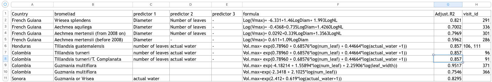

# Where do the volume estimation equations come from?

There are several equations that are used to estimate the maximum volume of 
plants in the experiment. What data are these derived from?

## list of the equations: 

Here are the equations which are listed in the file `CommunityAnalysis\CESAB trait working group\Max_Volume_models`:

```{r fig.cap = ""}

```

Can we reproduce these results? Doing so has several advantages:

1. We can update these equations when we get more data (and/or see where we might need _more_ data)
2. We can predict the new values with *error* (i.e. preserve the standard error 
of the estimated value). We can then use this later in the analysis, to
downweight predicted values relative to observed ones


## Data source: French Guiana

```{r}
#  in using the Supplementary data, I'm going to rename the columns --
#  eventually move this process to the outside, to remake
Supp_data <- supp_data_additional %>% 
  rename(diameter = Diam1, num_leaf = NL, max_water = Vmax) %>% 
  select(-Diam2)
```


In the French Guianan datasets that we currently have in the database, Maximum Volume (`max_water`) was rarely measured directly. However other size variables were, such as diameter, number of leaves and actual volume. 
<!--add a link to the "transcript" of Regis and Kurt's work -->

Below I'm going to review where each model comes from, as an intermediate step between the modelling done already and adding them to the database data-preparation workflow. Here is how I'm going to refer to each of the two sources of data:

* **BWGdatabase** means data that has been uploaded to the BWG database, which is online
* **supplementary data** data that Regis et al collected in the field. 
<!-- add in summaries of models later when this is organized?? -->

### _Vriesea splendens_: `v1`

Right away this is kind of confusing. In the table above the following equation is given

```r
Log(Vmax)= -6.331+1.46LogDiam+ 1.993LogNL
```

But, in `24_volumen.R` the following equation is used, ostensibly for Vriesea:

```r
#FrenchGuianaVriesea2007, Vriesea splendens No information of diameter and number of leaf, information about actual water
#select data set only Vriesea splendens and create an equation
# Equation vmax = 1.4144*actual vol + 39.343
volFrench2007Vrisea<- function(a){1.4144*a + 39.343}
summ_broms <-summ_broms%>%
  mutate(max_water= ifelse(visit_id == 341 & species=="Vriesea splendens", volFrench2007Vrisea(actual_water), max_water))
```

No information? what does that mean in this context? Does that mean that Diam1 or volume is missing from either the **BWG data** or the **supplementary data**?

```{r}
Supp_data %>% 
  filter(species == "Vrisea_splendens") %>% 
  head %>% 
  kable
```

No, the data is there. Do the model parameters match?

```{r}
vrisea_diam_nl_mod <- Supp_data %>% 
  filter(species == "Vrisea_splendens") %>% 
  lm(log(max_water) ~ log(diameter) + log(num_leaf), data = .) 

kable(tidy(vrisea_diam_nl_mod))

kable(glance(vrisea_diam_nl_mod))
```

```{r}
Supp_data %>% 
  filter(species == "Vrisea_splendens") %>% 
  ggplot(aes(x = diameter,
             y = max_water,
             size = num_leaf,
             fill = num_leaf)) + 
  geom_point(pch = 21) + 
  theme_bw() + 
  scale_fill_gradient(high = "#132B43", low = "#56B1F7") + 
  stat_smooth()

```


What does this `visit` of `291` in the table mean?? `r#unique(bromeliad_detritus$dataset_name[bromeliad_detritus$visit_id == "291"])`

```{r}
# visname <- unique(bromeliad_detritus$dataset_name[bromeliad_detritus$visit_id == "291"]

bromeliad_detritus  %>% 
  filter(visit_id == "291") %>% 
  select_("diameter", "num_leaf", "max_water", "species") %>% 
  vis_dat()
```

Well there seems to be no such data in the database, at least not for this site! So this regression could neither be created nor used in Petit Saut.. so what does the `219` mean??

#### the linear version

The code above references a linear relationship  

Where could it even be used? 

```{r}
bromeliad_detritus  %>% 
  filter(species %>% str_detect("splendens")) %>% 
  vis_miss(cluster = TRUE)
  
```

OK so all _V. splendens_ have `actual_water`, but most lack `num_leaf` (and those that don't, have `max_water` anyway). From the way the function is used above, it seems that `max_water` was being predicted by `actual_water`. 

This doesn't exist in the Supplementary Data
```{r}
kable(head(Supp_data))
```

So it must have come from the BWG data?
```{r}
splendens_maxwater <- bromeliad_detritus %>% 
  filter(species %>% str_detect("splendens"), 
         !is.na(max_water))

splendens_maxwater_mod <- splendens_maxwater %>% 
  lm(max_water ~ actual_water, data = .)

kable(tidy(splendens_maxwater_mod))
kable(glance(splendens_maxwater_mod))
```
this is from `r#unique(splendens_maxwater$dataset_name)` which is visit number `r#unique(splendens_maxwater$visit_id)`

Well, a relationship can definitely be created, but its parameters do not resemble the original at all. 

```{r fig.cap="actual water is weakly correlated with maximum water."}
splendens_maxwater %>% 
  ggplot(aes(x = actual_water, y  = max_water)) + 
  geom_point() + 
  stat_smooth(method = "lm") + 
  coord_fixed(ratio = 1, xlim = c(0, 350), ylim = c(0, 350)) + 
  geom_abline(slope = 1, intercept = 0, lty = 2)
```

## _Aechmea aquilega_, diameter and number of leaves, `v2`

The R script and the "equation table" agree this time: 

```r
#Nouragues2009,Sinnamary2011, Aechmea aquilega Vmax= exp(-0.4368 +0.735*log(fg1$diameter)+ 1.4260*log(fg1$num_leaf))
volNouragues2009<- function(a,b){exp(-0.4368 +0.735*log(a)+ 1.4260*log(b))}
summ_broms <- summ_broms%>%
  mutate(max_water= ifelse(visit_id == 336|visit_id==331, volNouragues2009(diameter,num_leaf), max_water))
```

We being by calculating the model

```{r}
A_aquilega_model <- Supp_data %>% 
  filter(species == "Aechmaea_aquilega") %>% 
  lm(log(max_water) ~ log(diameter) + log(num_leaf), .)

kable(glance(A_aquilega_model))
kable(tidy(A_aquilega_model))
```

These are the same! let's visualize it just because:

```{r fig.cap="Relationship between diameter and maximum water volume. Note that the line is jut a smooth loess fit, and it not related to the model"}
Supp_data %>% 
  filter(species == "Aechmaea_aquilega") %>% 
  ggplot(aes(x = diameter, y = max_water)) + 
  geom_point(aes(size = num_leaf,
           fill = num_leaf), pch = 21) + theme_bw() + 
  scale_fill_gradient(high = "#132B43", low = "#56B1F7") + stat_smooth()

```

## _Aechmea mertensii_ prior to 2008


### Brouillon
There seem to be two data sources:

1. *the database itself*  which contains observations of Bromeliad size (leaves,
diameter, etc) and also of volume (frequently `actual_volume`, rarely
`maximum_volume`)

Let's look at how these variables relate to each other:

```{r}
ggplot(supp_data_additional, aes(x = Diam1, y = Vmax, size = NL)) + 
  geom_point(alpha = 0.5) + 
  facet_wrap(~species, scales = "free")
```

There is a misspelling! is file name any better for splitting up species:

```{r}
ggplot(supp_data_additional, aes(x = Diam1, y = Vmax, size = NL)) + 
  geom_point(alpha = 0.5) + 
  facet_wrap(~filename, scales = "free")
```

Nope same error. Better fix the species then:

```{r}
size_dat_species <- supp_data_additional %>% 
  mutate(species = if_else(str_detect(species, "Vri.*"), "Vriesea", species))

ggplot(size_dat_species, aes(x = Diam1, y = Vmax, size = NL)) + 
  geom_point(alpha = 0.25) + 
  facet_wrap(~species, scales = "free", ncol = 1) + 
  theme_bw()
```

Some of these relationships seem quite strong. Others are from experiments where size and volume was tightly controlled -- so not surprising that diameter and volume do not vary much!

## what's in these data

```{r}
vis_miss(size_dat_species)
```


## Where did the equations come from?

I have in hand several equations (photo) which were apparently derived (in part?) from these data. 

### Volume predicted with Diameter:

```{r}
bromeliad_diam_models <- supp_data_additional %>%
  group_by(filename) %>%
  nest %>%
  mutate(pred_vo = map(data, ~ lm(log(Vmax) ~ log(Diam1), data = .x)))
```

```{r}
model_coefs <- bromeliad_diam_models %>% 
  mutate(output = map(pred_vo, tidy)) %>% 
  unnest(output) %>%
  mutate(estimate = round(estimate, digits = 5))

model_coefs %>% 
  select(filename, term, estimate) %>% 
  spread(term, estimate) %>% 
  kable
```

Fortunately, at least one line in this table is familiar: this is the line for `vriesea`, which shows `0.62` and `1.06` -- this matches one equation! However, comments around the table show that it is from a different bromeliad: 

```r
## ~/Dropbox/communityanalysis/CESAB\ trait\ working\ group/Max_Volume_models/
## FrenchGuianaAechmea2007,
## Equation= exp(0.611+1.09*log(diameter)) for Aechmea mertensii
volFrench2007<- function(a){exp(0.611+1.09*log(a))}
```

### Volume predicted with Diameter AND Number of Leaves

```{r}
bromeliad_diam_models <- supp_data_additional %>%
  group_by(filename) %>%
  nest %>%
  mutate(pred_vo = map(data, ~ lm(log(Vmax) ~ log(Diam1) + log(NL), data = .x)))
```

```{r}
model_coefs <- bromeliad_diam_models %>% 
  mutate(output = map(pred_vo, tidy)) %>% 
  unnest(output) %>%
  mutate(estimate = round(estimate, digits = 5))

model_coefs %>% 
  select(filename, term, estimate) %>% 
  spread(term, estimate) %>% 
  kable
```


## Within species (not dataset)


```{r}
species_models <- size_dat_species %>% 
  group_by(species) %>% 
  nest %>% 
  mutate(pred_vo = map(data, ~ lm(log(Vmax) ~ log(Diam1) + log(NL), data = .x)))
```

Let's look a the parameters of these:

```{r}
species_models %>% 
  mutate(output = map(pred_vo, tidy)) %>% 
  unnest(output) %>%
  mutate(estimate = round(estimate, digits = 5)) %>% 
  select(species, term, estimate) %>% 
  spread(term, estimate) %>% 
  kable
```

Another match! This time, it makes sense:

```r
#Nouragues2009,Sinnamary2011, Aechmea aquilega Vmax= exp(-0.4368 +0.735*log(fg1$diameter)+ 1.4260*log(fg1$num_leaf))
volNouragues2009<- function(a,b){exp(-0.4368 +0.735*log(a)+ 1.4260*log(b))}
summ_broms <- summ_broms%>%
  mutate(max_water= ifelse(visit_id == 336|visit_id==331, volNouragues2009(diameter,num_leaf), max_water))
```

## unidentified FG models

```r
#FrenchGuianaAechmea2008,PetitSaut, Aechmea mertensii, Vmax=exp(4.838+5.5888*log(diameter)-1.1649*(log(fg$diameter))^2+5.7181*log(fg$num_leaf)-1.7982*(log(fg$num_leaf)^2))
volFrench2008<- function(a,b){exp(0.0292 +0.339*log(a) + 1.3563*log(b))}
summ_broms <- summ_broms%>%
  mutate(max_water= ifelse(visit_id == 301, volFrench2008(diameter,num_leaf), max_water))

#FrenchGuianaAechmea2008,Kaw, Aechmea mertensii,Vmax= exp(0.0292 +0.339*log(fg$diameter) + 1.3563*log(fg$num_leaf))
volFrench2008_2<- function(a,b){exp(0.0292 +0.339*log(a) + 1.3563*log(b))}
summ_broms <- summ_broms%>%
  mutate(max_water= ifelse(visit_id == 296, volFrench2008_2(diameter,num_leaf), max_water))
```

These two models are the same, but are applied to different places. I have no idea where they came from. 

### linear (not power law) equation:

```r
#FrenchGuianaVriesea2007, Vriesea splendens No information of diameter and number of leaf, information about actual water
#select data set only Vriesea splendens and create an equation
# Equation vmax = 1.4144*actual vol + 39.343
volFrench2007Vrisea<- function(a){1.4144*a + 39.343}
summ_broms <-summ_broms%>%
  mutate(max_water= ifelse(visit_id == 341 & species=="Vriesea splendens", volFrench2007Vrisea(actual_water), max_water))
```

### Were they derived from the database itself?

Its possible that these numbers were not from these "supplementary" data, but from the actual database itself. Let's look at all the data from French Guiana that is in the BWG database (bromeliads only:)


```{r fg_brom_missing, fig.cap="Visualizing data from all bromeliads in French Guiana."}
dats_date %>%
  filter(country == "French Guiana") %>%
  select(dataset_name = name) %>%
  semi_join(bromeliad_detritus, .) %>%
  keep(~ any(!is.na(.x))) %>% 
  vis_dat(sort_type = TRUE)
```

Well, actual water is frequently recorded -- but Maximum Volume is missing for almost all plants, so this is probably not where the regressions come from. 

## other sites

We *DO* use data from other sites to find the relationship between `max_water` and volume. Specifically in these three sites:

### Guzmania

where are they?
```{r}
only_guzmania <- bromeliad_detritus %>% 
  filter(grepl("^Gu|^G\\.", species))

kable(head(only_guzmania))
```

```{r}
library(ggmissing)
ggplot(only_guzmania, aes(x = num_leaf, y = max_water, size = actual_water)) + 
  geom_missing_point()

# shape for species
```

There are several missing values, which we can remove for any plots (and also from the modelling)

```{r}
only_guzmania_complete <- only_guzmania %>% 
  select(num_leaf, max_water, actual_water) %>% 
  filter(complete.cases(.))

guz_plot <- ggplot(only_guzmania_complete, 
       aes(x = actual_water,
           y = max_water,
           size = num_leaf,
           fill = num_leaf)) + 
  geom_point(pch = 21) + theme_bw() + 
  geom_abline(intercept = 0, slope = 1, lty = 2) + 
  scale_fill_gradient(high = "#132B43", low = "#56B1F7") + 
  coord_fixed()

print(guz_plot)

guz_plot + stat_smooth(method = "gam")

guz_plot + 
  scale_y_log10() + 
  scale_x_log10()
```

Unsurprisingly, the data show a triangular relationship -- the actual volume can never be greater than the maximum volume. **Is that a problem for regressions?**  

At any rate, what was the work that was done already? 

```r
# Model for Honduras and Colombia2000, 2001
# plot(log(guz_only$num_leaf),log(guz_only$max_water))
# summary(lm(log(max_water)~log(num_leaf) + log(actual_water +1),data=guz_only ))

# Equation for Honduras and Colombia2000 and 2001:

Vmax=exp(0.78960 + 0.68576*log(Col$num_leaf) + 0.44664*log(Col$actual_water +1))
```

Can we reproduce this? 

```{r}
vmax_guzmania <- lm(log(max_water) ~ log(num_leaf) + log(actual_water + 1), 
                    data = only_guzmania_complete)

vmax_guzmania %>% 
  tidy %>% kable
  
```

Fortunately , this works just fine! 

### Guzmania volume from `num_leaf` only
```{r}
vmax_guzmania_leafonly <- lm(log(max_water) ~ log(num_leaf), 
                    data = only_guzmania_complete)

vmax_guzmania_leafonly %>% 
  tidy %>% kable
```

Unfortunately, this does *not* match:

```r
#Model for Colombia.Rioblanco 2012 (366) and ElVerde
# summary(lm(log(max_water)~log(num_leaf),data=guz_only))

# equation for Colombia.Rioblanco 2012 (366) and ElVerde Vol.max=exp(-2.3418 + 2.1025*log(Col2012$num_leaf))
#Guzmania
volColombia2012<- function(a){exp(-2.3418 + 2.1025*log(a))}
```

